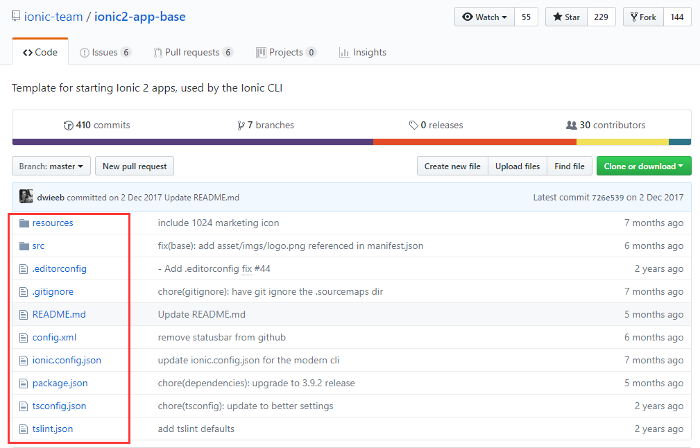
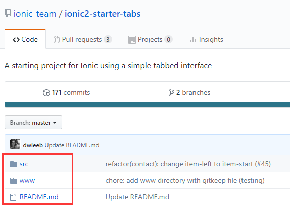

[TOC]

# ionic3自学笔记

## ionic模板下载失败的解决方式：

参考 https://blog.csdn.net/cmengzhongren/article/details/80763115

主要思路就是直接访问github上面的ionic-team项目：https://github.com/ionic-team

找到对应的模板，然后将对应源文件内容覆盖本地文件夹即可。操作步骤如下：

1. 访问https://github.com/ionic-team
2. 搜索 “base” ，下载 “ionic2-app-base”，该文件夹包含了 ionic 项目需要的配置文件

3. 再去搜索 “tabs”，下载 “ionic2-starter-tabs”（注：这是使用的是 ionic2，如果使用 ionic1 的，请下载 “ionic-” 为前缀的），文件夹只包含 src 和 www 两个文件夹，其中 src 实现 tabs 类型的逻辑 ，src 也是平常开发过程中最熟悉的部分

   

   4. 上述文件下载好，把 “ionic2-starter-tabs” src 中的 app 和 pages 这个两个文件夹复制到 “ionic2-app-base” 的 src 中。最后，“ionic2-app-base” 就是一个完整的 tabs app 项目了，安装依赖即可运行项目，创建其他类型的 app 项目也可以这样操作。

      